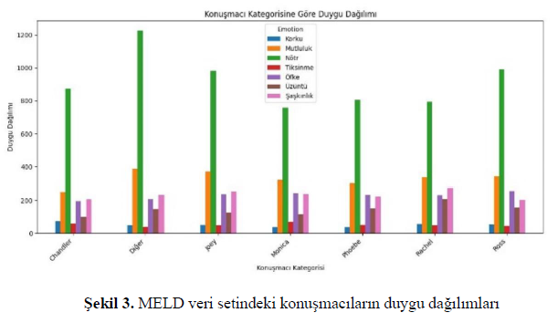
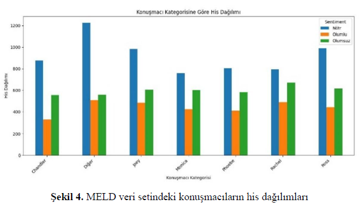
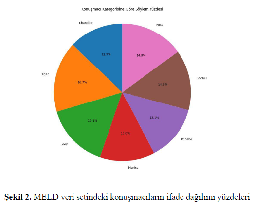

# Bitirme Projesi - Multimodüler Duygu Analizi ile Yapay Sinir Ağları
**Öğrenciler**: Rabia Şevval Aydın, Sude Nur Tungaç

**Danışman**: Doç. Dr. Ayşe Berna Altınel

**Tarih**: Haziran 2025

---

## Proje Hakkında
Bu proje, diyalog verileri üzerinde duygu analizini
Bu proje, diyalog verileri üzerinde duygu analizi görevini gerçekleştiren yapay sinir ağlarının performanslarının değerlendirilerek; metin, ses ve görüntü modaliteleri için optimal yöntemlerin belirlenmesini hedefler. 

**Kullanılan Veri Setleri**
**MELD**
- 'Friends' televizyon dizisinden toplanmış 1433 diyaloga ait 13000'den fazla ifadeden oluşur.
- Her bir ifade için pozitif, negatif ve nötr olmak üzere 3 duygu sınıfı bulunur.
- Her bir ifade için sinir, tiksinti, üzüntü, mutluluk, korku, nötr, şaşkınlık olmak üzere 7 duygu etiketi bulunur.
- Aşağıda sırasıyla MELD veri setinden örnek bir diyalog, veri setindeki konuşmacıların duygu dağılım grafiği, konuşmacı his dağılımı ve konuşmacıların ifade dağılım yüzdesi bulunmaktadır.





**IEMOCAP**
- 


**Kullanılan Ana Modeller**
- bcLSTM
- DialogueRNN, RoBERTa + DialogueRNN
- COSMIC
---
## 📂 Proje Repo Yapısı
```
bitirme-tezi/
│── data/                  # Veri kümesi
│   ├── raw/               # Ham veri seti (orijinal hali)
│   ├── processed/         # Ön işlenmiş ve dönüştürülmüş veriler
│   ├── features/          # Özellik çıkarılmış veriler
│── src/                   # Kaynak kodlar (ana Python scriptleri)
│   ├── preprocessing.py   # Veri temizleme ve ön işleme
│   ├── feature_extraction.py  # Özellik çıkarımı (MFCC, spectrogram vb.)
|   ├── model.py           # İlk model denemesi
│── notebooks/             # Jupyter Notebook'lar (Keşifsel analiz vb.)
│   ├── rabia_workspace    # Local çalışma alanı, git tarafından takip edilmez
│   ├── sude_workspace     # Local çalışma alanı, git tarafından takip edilmez
│── docs/                  # Proje dökümantasyonu
│   ├── README.md          # Proje açıklamaları
│── environment.yml        # Conda ortamının paket bilgileri
│── .gitignore             # İstenmeyen dosyaları git takibinden çıkarmak için
```
---
## Sonuçlar
**---bcLSTM Modelinin MELD veri seti üzerinde duygu analizinde sınıflara ait f1-skorları ve doğruluk değerleri---**
| Modeller / Duygular           | nötr   | şaşkınlık | korku | üzüntü | sevinç | tiksinti | sinir | doğruluk |
|-------------------------------|--------|-----------|-------|--------|--------|----------|-------|----------|
| Base model text               | 0.6498 | 0.00      | 0.00  | 0.00   | 0.00   | 0.00     | 0.00  | 0.4812   |
| Base model audio              | 0.4578 | 0.00      | 0.00  | 0.00   | 0.00   | 0.00     | 0.00  | 0.3390   |
| Bimodel base text+audio       | 0.6518 | 0.0137    | 0.00  | 0.00   | 0.1240 | 0.00     | 0.272 | 0.4816   |


**---MELD ve IEMOCAP veri setinde DialogueRNN ve COSMIC modellerinin duygu sınıflandırmasına ait f1-skor değerleri---**

| Modeller / Veri Setleri      | MELD text | MELD audio | MELD multimodal | IEMOCAP |
|-------------------------------|-----------|------------|-----------------|---------|
| DialogueRNN                   | 57.27     | 43.24      | 57.68           | 60.60   |
| RoBERTa + DialogueRNN         | 47.10     | 47.47      | 50.40           | –       |
| RoBERTa + COSMIC              | 64.36     | –          | –               | 66.34   |
